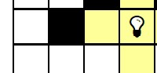
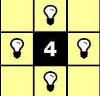
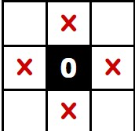
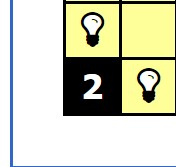
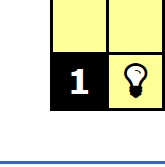
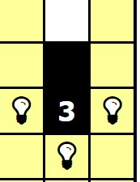
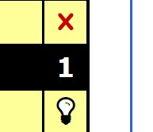
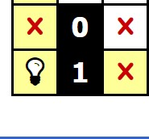
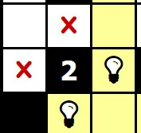

# 🧠 RESUMEN TAREA AI
[light Up Aplication Link](https://es.puzzle-light-up.com/)

## 			📄 CONCEPTOS

**Enfoque en el método** : esto es que se quiere tener el mismo resultado, replicando los pasos que sigue la persona en la obtención de tal resultado. En el caso de el trabajo deben ser las restricciones

**backtraking** : Es un algoritmo que sirve para encontrar soluciones a un problema, por lo general problemas de satisfacción de restricciones, los backtracks son las alternativas que no cumplen con las restricciones planteadas.

## 			📖 TRABAJO

**Resumen del desarrollo**: debemos desarrollar un backtraking, utilizando técnicas de satisfacción de restricciones como en IO.

**Detalles de la implementación**: 

- el algoritmo debe replicar el comportamiento de una persona.
- la agregación de una ampolleta no puede ser modificada,cambiada o eliminada una vez puesta
- deben aplicarse reglas
- el algoritmo debe ser capas de iluminar cualquier tablero de N x N
- no puede utilizar el backtracking( no puede generar y descartar cambios )

------


## 👓 ABSTRACCIÓN

#### PROBLEMA

```
MATRIS largo [ N X N ] --------------- > VECTOR  largo [ N ^2 ] 

N ---------- > auxNum
pos -------- > posición
```


#### NUESTRAS MATRICES SON VECTORES  ¿ como operamos la posición en nuestros valores?


|   🔼 ARRIBA   |   🔽 ABAJO    | ◀️ IZQUIERDA | ▶️ DERECHA |
| :----------: | :----------: | :---------: | :-------: |
| pos - auxNum | pos + auxNum |   pos - 1   |  pos +1   |


### VECTOR  OBJETIVO

    BLANK --------------->NONE
    BLOCK ------------>-1
    0 ----------------> 0
    1 ----------------> 1
    2-----------------> 2
    3-----------------> 3
    4-----------------> 4

### VECTOR LUZ

	1 -----------> iluminado (casillas tambien)
	0 -----------> no iluminado
	-1 ------------> restringido

### VECTOR ILUMINACION

    
    1 ----------------> iluminado
    0  ----------------> no iluminado


------


## ⚠️RESTRICCIONES  

**restricciones generales:** 

se tendrá que iluminar solo los sectores desde la luz hasta los bloques negros



Posibles movimientos



restricciones primordiales: prioridad primera





Restricciones de posibilidad: prioridad secundaria








Condiciones especificas: prioridad secundaria 







